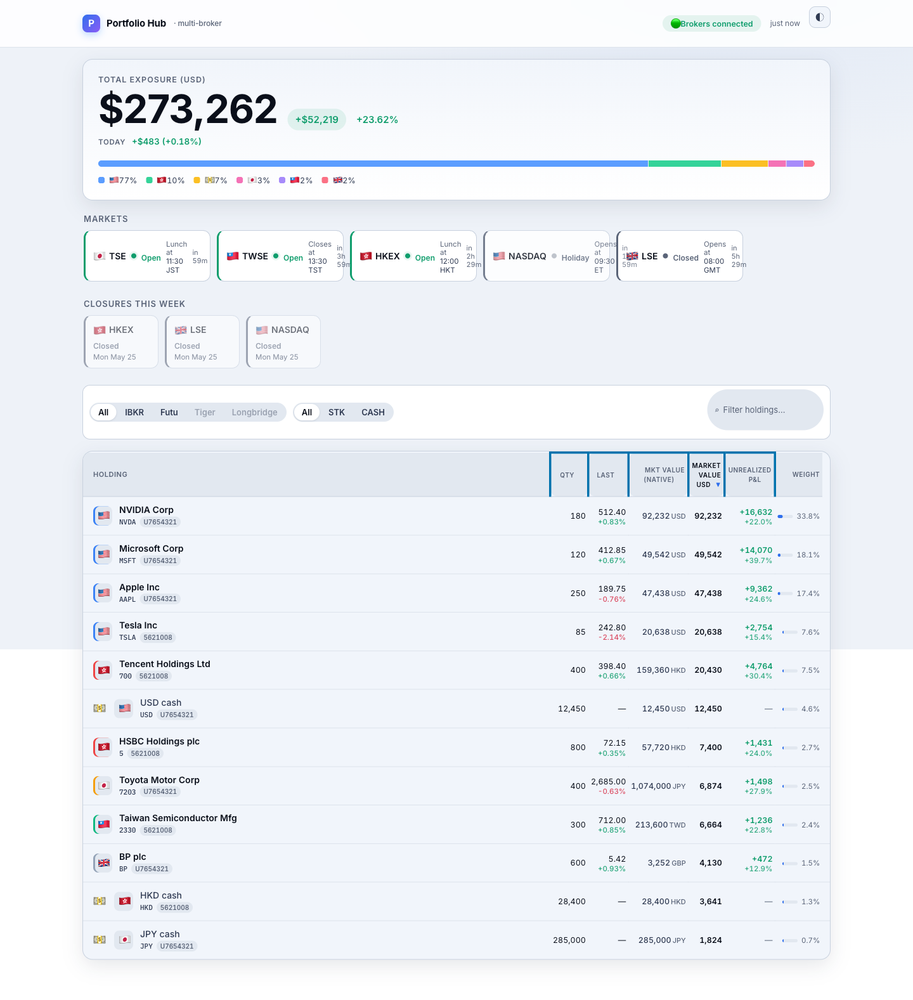
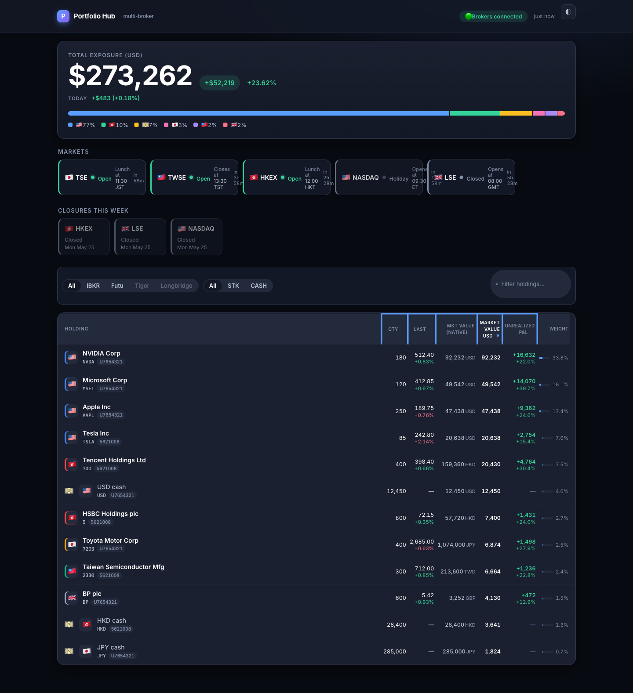
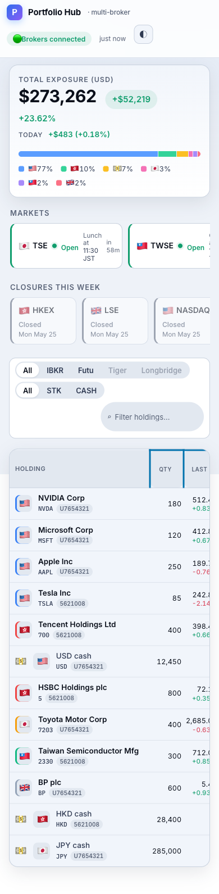

# portfolio-hub

[](https://opensource.org/licenses/Apache-2.0)
[](https://www.python.org/)
[](https://fastapi.tiangolo.com/)

**One dashboard for every brokerage account you actually use.**

Live cross-broker P&L, exchange-aware market hours, and intraday movement — all
on a single page that loads in under a second from a phone over Tailscale.
No SaaS sign-up, no portfolio aggregator pretending to be your custodian,
no real cash leaving the device that's running this.



> *Screenshots use mock fixtures (see [`scripts/serve_mock.py`](./scripts/serve_mock.py)) — no real holdings.*

## Why this exists

Most portfolio aggregators either ingest a CSV (stale by the time it loads),
scrape brokerage websites (fragile, slow, blocked), or sit in front of an
account-linking middleman (your credentials, their server). portfolio-hub
talks directly to **the gateways your brokers already publish** — IB Gateway
and MooMoo/Futu OpenD — runs on a spare laptop on your tailnet, and shows
exactly what's in your accounts right now. The only network surface is the
Tailscale boundary.

## What you see

| | |
|---|---|
|  |  |
| *Dark theme — auto-follows OS, override with the toggle.* | *Mobile — full feature parity, horizontal rail scrolls.* |

- **Live row deltas via SSE.** Tick updates land row-by-row without re-rendering the page.
- **Cross-broker P&L** — IBKR and MooMoo/Futu positions in one ordered table, with per-broker totals derivable from chips.
- **Multi-currency, FX-aware.** USD, HKD, JPY, EUR, GBP, TWD, SGD, KRW, AUD; FX rates from the broker with a public-API fallback (`📡` badge) when the broker rate is stale or unavailable (`⚠️`).
- **Intraday "Today" P&L** separate from cumulative unrealized P&L — answers "how am I doing *today*?" without doing the math.
- **Exchange-aware market hours** — every held venue gets a card showing Open/Lunch/Closed/Holiday/Extended-hours with a live countdown to next transition (HKEX lunch breaks, US pre/post-market, etc.).
- **Closures this week** — Mon–Fri full holidays and scheduled early closes for the exchanges you hold, sourced from `exchange_calendars`. Half-day early closes (e.g., day-after-Thanksgiving 13:00 ET) flagged separately from full closures.
- **Region-correct flags.** 🇭🇰 for HKEX, 🇹🇼 for TWSE, 🇨🇳 only for SSE/SZSE — never collapsed. Same for cash balances.
- **Sortable, filterable, searchable.** Click any numeric column to sort; chips filter by broker / account / asset class; type to filter holdings by name or symbol.

## Brokers

| Broker | Status | How it connects | Required |
|---|---|---|---|
| **Interactive Brokers (IBKR)** | ✅ Production | TWS API via `ib-gateway-docker` (`gnzsnz/ib-gateway-docker`) on a Read-Only API key | IB account, IB Gateway credentials |
| **MooMoo / Futu** | ✅ Production | OpenAPI socket via a local OpenD process | MooMoo/Futu account, OpenD installed and logged in |
| Tiger Brokers | 📋 Planned (Protocol-ready) | n/a | — |
| Longbridge | 📋 Planned (Protocol-ready) | n/a | — |

The `Broker` protocol is the only contract — adding a fourth broker doesn't
touch the UI, market-hours engine, FX service, or snapshot job.

### Running with IBKR only (default)

```bash
cp .env.example .env
# Edit IB_HOST / IB_PORT / IB_CLIENT_ID; ensure read-only API key is set
docker compose up -d ib-gateway        # gnzsnz/ib-gateway-docker
docker compose up dashboard
```

The dashboard binds to `127.0.0.1` only by default; expose over Tailnet by
binding to your tailnet IP (`tailscale ip -4`).

### Running with IBKR + MooMoo/Futu together

```bash
# .env
BROKERS_ENABLED=ibkr,futu
FUTU_HOST=host.docker.internal       # OpenD runs on the host
FUTU_PORT=11111
FUTU_MARKETS=HK,US,SG                  # markets to subscribe to
FUTU_SECURITY_FIRM=FUTUSG              # FUTUSG / FUTUHK / FUTUINC / MOOMOOSG
```

```bash
scripts/setup_opend.py install         # downloads + unpacks OpenD into .opend/
# Edit .opend/<version>/OpenD.xml to set your real login (replace 100000/123456)
scripts/setup_opend.py start           # launches OpenD locally, waits for API port
scripts/setup_opend.py check           # confirms the dashboard can reach the OpenD socket
docker compose up dashboard
```

OpenD is a separate gateway process that holds your MooMoo/Futu credentials —
portfolio-hub never sees them. The helper script only installs, starts, and
checks the local OpenD; you log in via OpenD's own XML config or UI.

Full details on OpenD setup (download archives, Privacy & Security hints on
macOS, `host.docker.internal` for Docker Desktop) in [`scripts/setup_opend.py`](./scripts/setup_opend.py).

## Try it without a broker

```bash
uv sync                                                  # or pip install -e .
BROKERS_ENABLED=ibkr,futu .venv/bin/python scripts/serve_mock.py
open http://127.0.0.1:8765
```

The mock script wires an in-memory portfolio of NVIDIA, Apple, Microsoft,
Tesla, Tencent, HSBC, Toyota, TSMC, BP plus cash balances across IBKR and
MooMoo/Futu accounts. Useful for screenshots, demos, and template hacking
without touching real positions.

## Stack

| Concern | Choice |
|---|---|
| Backend | FastAPI · Python 3.13+ |
| Frontend | HTMX · Alpine.js · Pico.css · Inter + IBM Plex Mono |
| Live updates | Server-Sent Events with row-level deltas |
| Persistence | SQLite (equity snapshots, fills, name cache, FX cache) |
| Market hours | `exchange_calendars` (XHKG, XTKS, XKRX, XTAI, XSHG, XSES, XASX, XLON, XETR, XPAR, XAMS, XSWX, XNYS, XTSE…) |
| Charts | TradingView Lightweight Charts (equity sparkline) |
| Auth | None — Tailnet is the boundary |
| Tests | 740 pytests; fake broker fixtures, no IBKR mocks |

## Design rules (hard)

- **HK / Taiwan / mainland China stay strictly distinct.** `🇭🇰` for HKEX, `🇹🇼` for TWSE, `🇨🇳` only for SSE/SZSE. Cash currencies follow the same rule: `HKD → 🇭🇰`, `TWD → 🇹🇼`, `CNH → 🇨🇳`. CNY is rejected at the adapter boundary.
- **Read-only at the gateway.** The IBKR Read-Only API key is set on the gateway itself, so accidental order placement is impossible at the protocol level — not just absent from the UI.
- **No public exposure.** Tailscale Funnel disabled. The dashboard binds to the tailnet interface only.
- **Dual-listed instruments stay separate.** `9988.HK` and `BABA.US` are different rows with different cost bases, by design.
- **Credentials never enter this app.** IBKR creds live in IB Gateway; MooMoo creds live in OpenD. portfolio-hub holds neither.

## Operations

- **Before going live**, work through [`docs/HITL-GOLIVE.md`](./docs/HITL-GOLIVE.md) — the human-in-the-loop verification checklist that gates "ready for daily use." Covers Tailscale boundary, read-only API enforcement, data-vs-TWS spot checks, market-hours panel accuracy, reconnect resilience, privacy logging, and seed-job sanity.
- Supporting scripts in [`scripts/`](./scripts):
  - `serve_mock.py` — runs the dashboard against an in-memory mock portfolio for screenshots/demos.
  - `setup_opend.py` — installs/starts/checks the local MooMoo/Futu OpenD copy.
  - `verify_read_only_api.py` — confirms the gateway rejects order placement.
  - `audit_privacy_log.sh` — greps logs for dollar-amount leaks at non-DEBUG levels.
  - `dump_seeds.py` — prints recent `equity_snapshots` / `fills` rows + live account-summary for TWS comparison.

## License

Apache 2.0 — see [LICENSE](./LICENSE) and [NOTICE](./NOTICE). Includes an
explicit patent grant; requires attribution and the license to be preserved
in derivative works.
