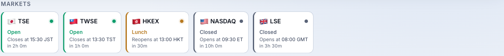
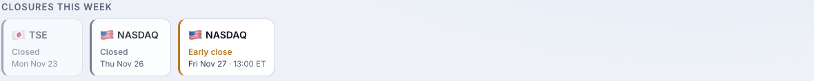

# portfolio-hub

[](https://opensource.org/licenses/Apache-2.0)
[](https://www.python.org/)
[](https://fastapi.tiangolo.com/)

**One dashboard for every brokerage account you actually use** — 🇺🇸 🇭🇰 🇯🇵 🇹🇼 🇨🇳 🇬🇧 🇩🇪 🇫🇷 🇸🇬 🇰🇷 🇦🇺 🇨🇦 — live, in a single page that loads in under a second from your phone over Tailscale.


> *Every screenshot here uses anonymous mock fixtures (see [`scripts/serve_mock.py`](./scripts/serve_mock.py)) — two demo brokers, illustrative prices, no real holdings.*

Live cross-broker P&L, exchange-aware market hours, and intraday movement, all in
one place. No SaaS sign-up. No portfolio aggregator pretending to be your custodian.
No real cash leaving the device that's running this.

## Why this exists

Most portfolio aggregators either ingest a CSV (stale by the time it loads),
scrape brokerage websites (fragile, slow, blocked), or sit in front of an
account-linking middleman (your credentials, their server). **portfolio-hub talks
directly to the APIs your brokers already publish** — IB Gateway, MooMoo/Futu
OpenD, Longbridge OpenAPI, and Tiger OpenAPI — runs on a spare laptop on your tailnet, and
shows exactly what's in your accounts right now. The only network surface is the
Tailscale boundary. IBKR and MooMoo/Futu login credentials never enter the app;
Longbridge and Tiger use API credentials supplied through your environment.

## Highlights

### 🔌 Every broker in one table

Interactive Brokers, MooMoo/Futu, Longbridge, and Tiger positions land in a single
ordered table.
Filter by broker, account, or asset class with chips; click any numeric column to
sort; type to search by name or ticker. Per-broker totals fall out of the chips —
no spreadsheet reconciliation, no tab-switching between four brokerage apps.

| | |
|---|---|
|  |  |
| *Tap a chip to filter to one broker — totals, market rail, and holdings all follow.* | *Mobile — full feature parity; the market rail scrolls horizontally.* |

Light and dark themes both ship and auto-follow your OS (override with the header toggle).

### 🌍 Exchange-aware market hours

Every venue you hold gets a card: **Open**, **Lunch**, **Closed**, **Holiday**, or
**Extended** (US pre/post-market), with a live countdown to the next transition.
HKEX and TSE lunch breaks, US extended hours, and 20+ exchanges are modeled from
the [`exchange_calendars`](https://github.com/gerrymanoim/exchange_calendars)
library — not hard-coded `09:30`–`16:00` guesses.



### 📅 Closures this week

A glanceable strip of upcoming market closures for the exchanges you actually hold:
full holidays **and** scheduled half-day early closes, flagged distinctly. So a
13:00 ET Black-Friday close never surprises you mid-trade.



### 💱 Multi-currency, FX-aware

Positions in USD, HKD, JPY, EUR, GBP, TWD, SGD, KRW, AUD (and more) are converted
to a single USD view. FX rates stream from the broker, with a public-API fallback
(`📡` badge) when the broker rate is stale (`⚠️`) or unavailable. Region flags stay
honest: `🇭🇰` for HKEX, `🇹🇼` for TWSE, `🇨🇳` only for SSE/SZSE — never collapsed.

### ⚡ Live & fast

Tick updates land **row by row** over Server-Sent Events — no full-page re-render,
no polling spinner. An intraday "Today" P&L line answers *"how am I doing today?"*
separately from cumulative unrealized P&L. The page is server-rendered, so it's
already useful before a single byte of JavaScript runs.

### 🔒 Private by design

IBKR credentials live in IB Gateway, and MooMoo/Futu credentials live in OpenD —
**portfolio-hub never sees them**. Longbridge and Tiger API credentials are read
from your deployment environment and should be read-only. The IBKR connection uses a
Read-Only API key, so order placement is impossible at the protocol level.
Tailscale Funnel is disabled; the dashboard binds to your tailnet interface only.

## Brokers

| Broker | Status | How it connects | Required |
|---|---|---|---|
| **Interactive Brokers (IBKR)** | ✅ Production | TWS API via `ib-gateway-docker` (`gnzsnz/ib-gateway-docker`) on a Read-Only API key | IB account, IB Gateway credentials |
| **MooMoo / Futu** | ✅ Production | OpenAPI socket via a local OpenD process | MooMoo/Futu account, OpenD installed and logged in |
| **Longbridge** | ✅ Production | Longbridge OpenAPI via read-only API key env vars | Longbridge account, OpenAPI app key/secret/access token |
| **Tiger Brokers** | ✅ Production | Tiger OpenAPI via config directory or API credential env vars | Tiger account, developer ID, account ID, and private key via `TIGER_PRIVATE_KEY` or `TIGER_PRIVATE_KEY_PATH` |

The `Broker` protocol is the only contract — adding a broker doesn't touch the UI,
the market-hours engine, the FX service, or the snapshot job.

## Get started

### Try it without a broker (zero setup)

The fastest way to see what this is — an in-memory portfolio across two demo
brokers, no gateway, no credentials:

```bash
uv sync                                                  # or pip install -e .
BROKERS_ENABLED=ibkr,futu .venv/bin/python scripts/serve_mock.py
open http://127.0.0.1:8765
```

The mock wires an anonymous portfolio of NVIDIA, Apple, Microsoft, Tesla, Tencent,
HSBC, Toyota, TSMC, and BP plus cash balances across IBKR and MooMoo/Futu accounts.
Great for screenshots, demos, and template hacking without touching real positions.

### Run with IBKR

```bash
cp .env.example .env
# Edit IB_HOST / IB_PORT / IB_CLIENT_ID; ensure the read-only API key is set
docker compose up -d ib-gateway        # gnzsnz/ib-gateway-docker
docker compose up dashboard
```

The dashboard binds to `127.0.0.1` only by default; expose it over your tailnet by
binding to your tailnet IP (`tailscale ip -4`).

### Add MooMoo / Futu

```bash
# .env
BROKERS_ENABLED=ibkr,futu
FUTU_HOST=host.docker.internal       # OpenD runs on the host
FUTU_PORT=11111
FUTU_MARKETS=HK,US,SG                  # markets to subscribe to
FUTU_SECURITY_FIRM=FUTUSG              # common: FUTUSG / FUTUINC / FUTUSECURITIES
```

```bash
scripts/setup_opend.py install         # unpacks the newest OpenD archive from ~/Downloads
# or: scripts/setup_opend.py install --archive ~/Downloads/<OpenD archive>
# or: scripts/setup_opend.py install --download-url <official OpenD archive URL>
# Edit .opend/<version>/OpenD.xml to set your real login (replace 100000/123456)
scripts/setup_opend.py start           # launches OpenD locally, waits for the API port
scripts/setup_opend.py check           # confirms the dashboard can reach the OpenD socket
docker compose up dashboard
```

OpenD is a separate gateway process that holds your MooMoo/Futu credentials —
portfolio-hub never sees them. The helper script only installs, starts, and checks
the local OpenD; you log in via OpenD's own XML config or UI. For other regions,
set `FUTU_SECURITY_FIRM` to the official `SecurityFirm` enum for that account, such
as `FUTUAU`, `FUTUCA`, `FUTUMY`, or `FUTUJP`. Full setup notes (download archives,
macOS Privacy & Security hints, `host.docker.internal` for Docker Desktop) live in
[`scripts/setup_opend.py`](./scripts/setup_opend.py).

### Add Longbridge

Create a read-only Longbridge OpenAPI key, then add the API credentials to
`.env`:

```bash
BROKERS_ENABLED=ibkr,futu,longbridge
LONGBRIDGE_APP_KEY=<your app key>
LONGBRIDGE_APP_SECRET=<your app secret>
LONGBRIDGE_ACCESS_TOKEN=<your access token>
LONGBRIDGE_ACCOUNT_ID=Longbridge
LONGBRIDGE_POSITION_CHANNEL=          # optional; set if Longbridge returns multiple channels
LONGBRIDGE_BASE_CURRENCY=USD
LONGBRIDGE_POLL_INTERVAL_S=30
```

The adapter reads stock positions, cash balances, account equity, static
security info, and quotes. It does not place orders or ingest execution history
in v1. If Longbridge returns more than one stock position channel, set
`LONGBRIDGE_POSITION_CHANNEL` to the single channel you want shown; v1 fails
clearly instead of merging channels.

### Add Tiger Brokers

Create Tiger OpenAPI credentials in the developer portal, then use either a
Tiger config directory or direct environment variables:

```bash
BROKERS_ENABLED=ibkr,futu,longbridge,tiger
TIGER_CONFIG_DIR=~/.tigeropen/          # or leave blank and set direct env vars
TIGER_ID=<your developer id>
TIGER_ACCOUNT=<your account id>
TIGER_PRIVATE_KEY=                     # private key content
TIGER_PRIVATE_KEY_PATH=                # or private key path
TIGER_BASE_CURRENCY=USD
TIGER_MARKETS=US,HK,SG,AU,CN
TIGER_POLL_INTERVAL_S=30
```

Set `TIGER_PRIVATE_KEY` or `TIGER_PRIVATE_KEY_PATH` unless your Tiger config
directory already supplies the key. If both are set, `TIGER_PRIVATE_KEY` takes
precedence. In Docker Compose, `TIGER_CONFIG_DIR_HOST_PATH` is mounted read-only
at `/run/tigeropen`, so set `TIGER_PRIVATE_KEY_PATH=/run/tigeropen/<key-file>`
when using a key file.

The adapter reads managed accounts, stock positions, cash buckets, account
assets, and stock quote briefs. It does not place orders or ingest execution
history in v1.

## Roadmap

The `Broker` protocol and the SQLite seed jobs already exist; these are the next
surfaces to build on them:

- **Equity curve / TWR / XIRR** — the backend already captures per-market-close
  net-liquidation snapshots into `equity_snapshots`; the UI is next.
- **Trade journal & realized P&L** — fills are streamed and reconciled end-of-day
  into `fills`, ready for a journal view.

## Stack

| Concern | Choice |
|---|---|
| Backend | FastAPI · Python 3.13+ |
| Frontend | HTMX · Alpine.js · Pico.css · Inter + IBM Plex Mono |
| Live updates | Server-Sent Events with row-level deltas |
| Persistence | SQLite (equity snapshots, fills, name cache, FX cache) |
| Market hours | `exchange_calendars` (XHKG, XTKS, XKRX, XTAI, XSHG, XSES, XASX, XLON, XETR, XPAR, XAMS, XSWX, XNYS, XTSE…) |
| Charts | TradingView Lightweight Charts (equity sparkline) |
| Auth | None — Tailnet is the boundary |
| Tests | 790+ pytests; fake broker fixtures, no IBKR mocks |

## Design rules (hard)

- **HK / Taiwan / mainland China stay strictly distinct.** `🇭🇰` for HKEX, `🇹🇼` for TWSE, `🇨🇳` only for SSE/SZSE. Cash currencies follow the same rule: `HKD → 🇭🇰`, `TWD → 🇹🇼`, `CNH → 🇨🇳`. CNY is rejected at the adapter boundary.
- **Read-only at the gateway.** The IBKR Read-Only API key is set on the gateway itself, so accidental order placement is impossible at the protocol level — not just absent from the UI.
- **No public exposure.** Tailscale Funnel disabled. The dashboard binds to the tailnet interface only.
- **Dual-listed instruments stay separate.** `9988.HK` and `BABA.US` are different rows with different cost bases, by design.
- **Broker credentials stay scoped.** IBKR creds live in IB Gateway; MooMoo creds live in OpenD. Longbridge and Tiger API credentials live in the dashboard environment and should be read-only.

## License & trademarks

Apache 2.0 — see [LICENSE](./LICENSE) and [NOTICE](./NOTICE). Includes an explicit
patent grant; requires attribution and the license to be preserved in derivative
works.

> Interactive Brokers, IBKR, MooMoo, Futu, Longbridge, and Tiger Brokers are trademarks of
> their respective owners. This project is independent and is not affiliated
> with, endorsed by, or sponsored by any of them.
